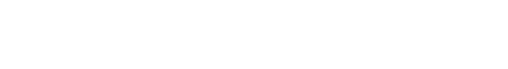

<p align="center">
  <a href="https://computeruseprotocol.com">
    
  </a>
</p>

<p align="center">
  <b>TypeScript SDK for the Computer Use Protocol</b>
</p>

<br>

<p align="center">
  <a href="https://www.npmjs.com/package/computeruseprotocol"></a>
  <a href="https://github.com/computeruseprotocol/typescript-sdk/blob/main/LICENSE"></a>
  <a href="https://github.com/computeruseprotocol/computeruseprotocol"></a>
</p>

The official TypeScript SDK for the [Computer Use Protocol (CUP)](https://github.com/computeruseprotocol/computer-use-protocol) — a universal protocol for AI agents to perceive and interact with any desktop UI. This package provides tree capture, action execution, semantic search, and an MCP server for AI agent integration.

## Installation

```bash
# npm
npm install computeruseprotocol

# bun
bun add computeruseprotocol
```

## Quick start

```typescript
import { snapshot, snapshotRaw, overview } from "computeruseprotocol";

// Capture the foreground window's accessibility tree
const text = await snapshot();
console.log(text);

// Full accessibility tree as a CUP envelope
const envelope = await snapshotRaw();

// List all open windows (near-instant)
const windows = await overview();
```

Output:

```
# CUP 0.1.0 | windows | 2560x1440
# app: Spotify
# 63 nodes (280 before pruning)

[e0] win "Spotify" 120,40 1680x1020
  [e1] doc "Spotify" 120,40 1680x1020
    [e2] btn "Back" 132,52 32x32 [clk]
    [e3] btn "Forward" 170,52 32x32 {dis} [clk]
    [e7] nav "Main" 120,88 240x972
      [e8] lnk "Home" 132,100 216x40 {sel} [clk]
      [e9] lnk "Search" 132,148 216x40 [clk]
```

### Session API

```typescript
import { Session } from "computeruseprotocol";

const session = await Session.create();

// Capture the foreground window
const text = await session.snapshot({ scope: "foreground" });
console.log(text);

// Execute actions
await session.action("e8", "click");
await session.press("ctrl+s");
await session.openApp("notepad");

// Semantic search
const elements = await session.find({ query: "submit button" });

// Batch actions
await session.batch([
  { element_id: "e2", action: "click" },
  { action: "wait", ms: 500 },
  { action: "press", keys: "ctrl+a" },
  { element_id: "e5", action: "type", value: "hello" },
]);
```

## CLI

```bash
# Print the foreground window's accessibility tree
npx cup

# Save full JSON envelope
npx cup --json-out tree.json

# Filter by app name
npx cup --app Discord

# Capture from Chrome via CDP
npx cup --platform web --cdp-port 9222

# Include diagnostics (timing, role distribution, sizes)
npx cup --verbose
```

## Platform support

| Platform | Adapter | Tree Capture | Actions |
|----------|---------|-------------|---------|
| Windows | UIA via PowerShell + C# | Stable | Stable |
| macOS | AXUIElement via Swift + JXA | Stable | Stable |
| Linux | AT-SPI2 via gdbus + xdotool | Stable | Stable |
| Web | Chrome DevTools Protocol | Stable | Stable |
| Android | | Planned | Planned |
| iOS | | Planned | Planned |

CUP auto-detects your platform. The Web adapter uses Chrome DevTools Protocol (CDP) and works on any OS. Native adapters use platform accessibility APIs via compiled helpers (C# on Windows, Swift on macOS, gdbus on Linux).

## Architecture

```
src/
├── index.ts                    # Public API: Session, snapshot, snapshotRaw, overview
├── types.ts                    # CUP type definitions
├── cli.ts                      # CLI entry point
├── base.ts                     # Abstract PlatformAdapter interface
├── router.ts                   # Platform detection & adapter dispatch
├── format.ts                   # Envelope builder, compact serializer, tree pruning
├── search.ts                   # Semantic element search with fuzzy matching
├── actions/                    # Action execution layer
│   ├── executor.ts             # ActionExecutor orchestrator
│   ├── keys.ts                 # Key combo parsing
│   ├── web.ts                  # Chrome CDP actions
│   ├── windows.ts              # Windows UIA + SendInput actions
│   ├── macos.ts                # macOS AX + CGEvent actions
│   └── linux.ts                # Linux AT-SPI2 + xdotool actions
├── platforms/                  # Platform-specific tree capture
│   ├── web.ts                  # Chrome CDP adapter
│   ├── windows.ts              # Windows UIA adapter
│   ├── macos.ts                # macOS AXUIElement adapter
│   └── linux.ts                # Linux AT-SPI2 adapter
└── mcp/                        # MCP server integration
    ├── server.ts               # MCP protocol server
    └── cli.ts                  # Stdio transport entry point
```

Adding a new platform means implementing `PlatformAdapter` — see [src/base.ts](src/base.ts) for the interface.

## MCP Server

CUP ships an MCP server for integration with AI agents (Claude, Copilot, etc.).

```bash
# Run directly
npx cup-mcp

# Or with bun
bun run src/mcp/cli.ts
```

Add to your MCP client config (e.g., `.mcp.json` for Claude Code):

```json
{
    "mcpServers": {
        "cup": {
            "command": "npx",
            "args": ["cup-mcp"]
        }
    }
}
```

**Tools:** `snapshot`, `snapshot_app`, `overview`, `snapshot_desktop`, `find`, `action`, `open_app`, `screenshot`

## Contributing

CUP is in early development (v0.1.0). Contributions welcome — especially:

- Android adapter (`src/platforms/android.ts`)
- iOS adapter (`src/platforms/ios.ts`)
- Tests — especially cross-platform integration tests
- Documentation and examples

For protocol or schema changes, please contribute to [computer-use-protocol](https://github.com/computeruseprotocol/computer-use-protocol).

See [CONTRIBUTING.md](CONTRIBUTING.md) for setup instructions and guidelines.

## Documentation

- **[API Reference](docs/api-reference.md)** — Session API, actions, envelope format, MCP server
- **[Protocol Specification](https://github.com/computeruseprotocol/computeruseprotocol)** — Schema, roles, states, actions, compact format

## License

[MIT](LICENSE)
